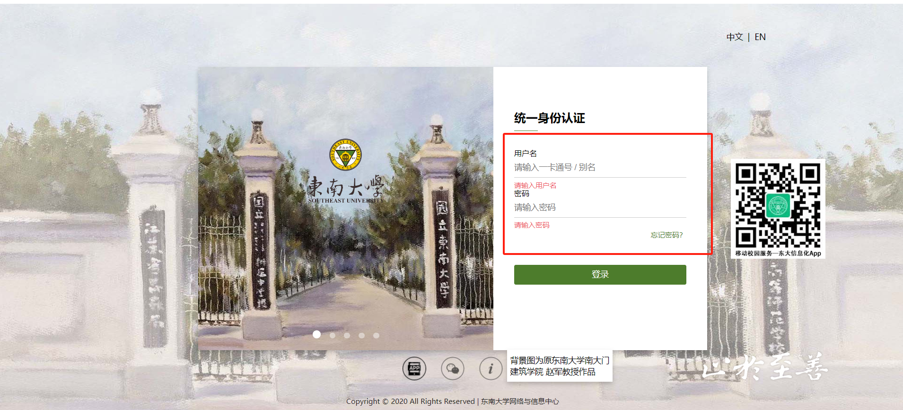

# Access Methods

In this chapter,we will introduce how to directly access the Taylor & Francis through CARSI.

# Enter Official Website

Open the browser using a non-campus IP address, enter https://www.taylorfrancis.com/, and click on the right side of the web page "Login" in the upper corner enters the login page.

# Select Login Method

Select the "With Shibboleth or OpenAthens" login method on the login page.

# SEU

Search for the school’s English name in the “Log in with Shibboleth or OpenAthens” input box and click the CONTINUE button.

# Unified Identity Authentication

Enter the unified identity authentication login interface of Southeast University and enter username and password.

# Success

After successful verification, you can access Taylor & Francis e-book resources.

