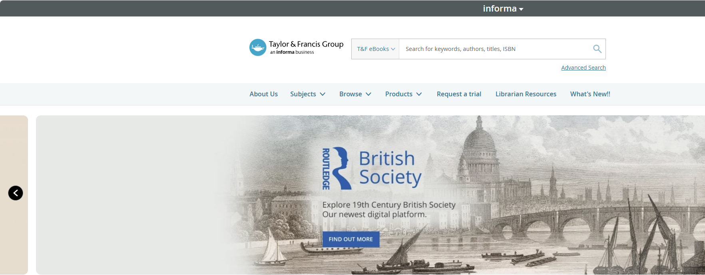
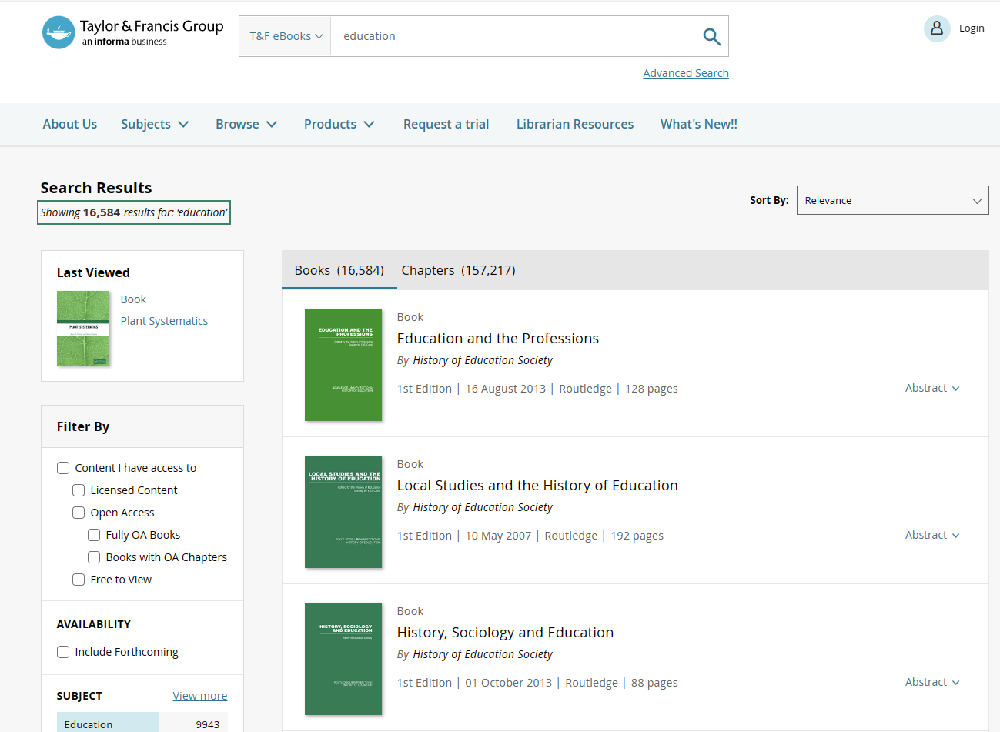
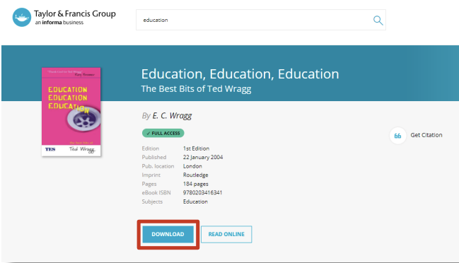
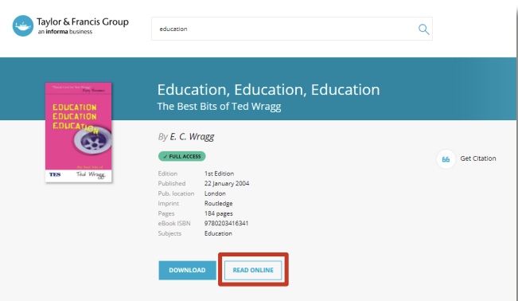

# Download & Read

Next, we will introduce how to download documents from Taylor & Francis. 

# Step 1: Search

Enter the title of the article we need, or authors in the search bar

# Step 2: Download

Users can download the entire e-book by clicking the "Download" button at the bottom of the bibliographic information page.

# Step 3: Read Online

Users can read the entire eBook by clicking the "Read Online" button at the bottom of the bibliographic information page. This will open an online reader where the user can search for the full text of the book, use the navigation to use the table of contents, select and print page ranges, and resize pages.

