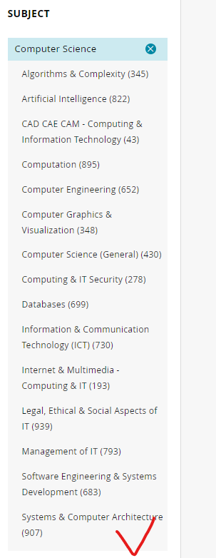
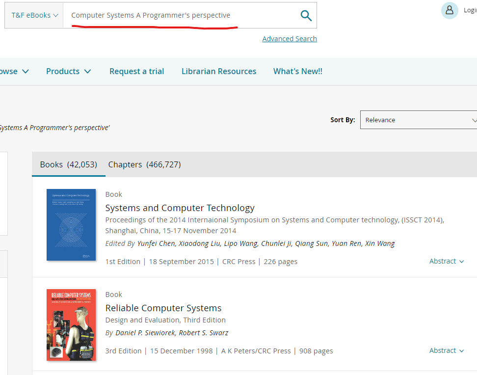

# Extra Content

# Unique Features

## The latest and cutting edge books

When you enter the type of book you want to search in the search box and sort the results by latest to oldest, you will see the following scenario.

There may be many unpublished books in the search results. There may be many unpublished books in the search results. You can use these books to keep up with the latest developments in a particular field.

## Extremely detailed domain segmentation

You can start by looking at the subjects in the navigation bar to find the categories you are interested in.

When we entered the computer science category, we could still choose more detailed directions that interested me, such as systems and computer architecture, from the left navigation bar.

Once we got into this category we could still go on to choose more specific fields, such as systems and computer engineering.

Of course, when you want to go back to a larger area of the previous level, you just need to uncheck the previous box in the subject location.

# Disadvantage

When we search for A particular book, for example: Computer Systems A Programmer's perspective, it may not appear in the results because the book is not well known in the field. But we would want a more widely read or authoritative book in the field.

At this point we'd like to be able to sort search results by downloads or views, but that's not an option.

We hope the data block will add the option to sort search results by views or downloads, helping readers sift through better books.