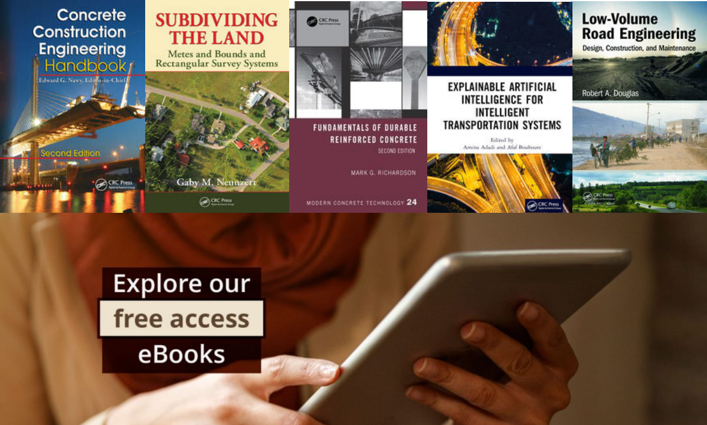
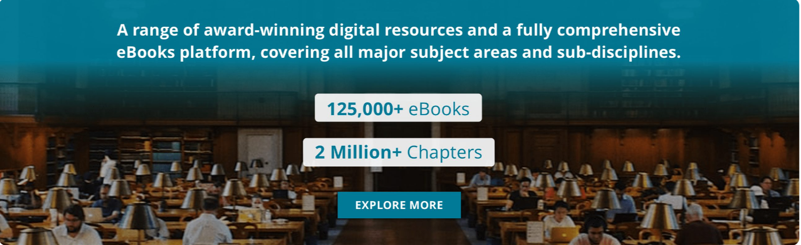

# Introduction

# About

Taylor & Francis eBooks is a single destination platform with eBooks in science, technology, engineering, medical, humanities and social science. It includes a librarian dashboard, which provides quick access to MARC and KBART reports, usage data, entitlements and much more. Researchers have a single point of discovery for eBook content, multiple search options, and more. Access to the platform will allow users to: search ebook content at both the book and chapter level, filter search results by subject area, publication date and year published, and create citations in APA format. Flexible purchase options, subject collections, and free trials are available.

# History

In 1852, the company, with William Francis, joined Richard Taylor's publishing business, which had been established in 1798. William Francis's son, Richard Taunton Francis (1883-1930), was the sole partner in the company from 1917 to 1930.

In 1990, the company withdrew from the printing industry and focused solely on publishing. In 1998, it went public on the London Stock Exchange and acquired its academic publishing competitor, Routledge, for £90 million in the same year. In 2004, it merged with Informa to form T&F Informa, which later reverted to the name Informa. After the merger, T&F closed Routledge's London office and relocated to its current headquarters in Milton Park, Oxfordshire.

In 2017, T&F acquired the digital resource company Colwiz. In January 2020, T&F acquired the open research publishing platform F1000. [1]

# Resource Type

**eBook**

# Resource quantity

**Its books cover a wide range of industry sectors, with more than 125,000 books and more than 2 million chapters**

# Subject coverage

**science, technology, engineering, medical, humanities and social science**

# Update frequency

**About 2,000 new titles are published each year.**

The update frequency of books published by Taylor & Francis Group can vary depending on the specific book and subject area. In general, Taylor & Francis Group update their books based on the relevance and developments in the respective fields.
Some books may be updated frequently, especially those on fast-moving fields, such as science and technology. Other books may be updated on a longer cycle, such as those in the social sciences or humanities.

# References

[1]: [Wikipedia contributors. (2023, September 18). Taylor & Francis. In Wikipedia, The Free Encyclopedia. Retrieved 05:20, October 11, 2023, from https://en.wikipedia.org/w/index.php?title=Taylor_%26_Francis&oldid=1175989385](https://en.wikipedia.org/w/index.php?title=Taylor_%26_Francis&oldid=1175989385)
