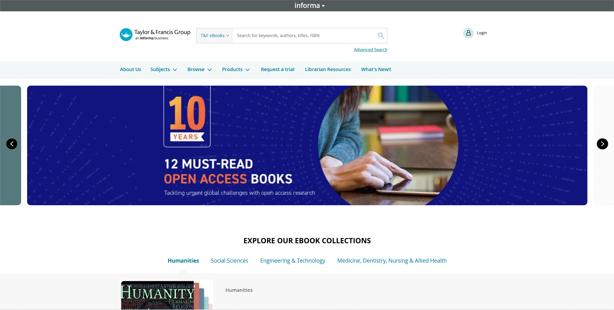
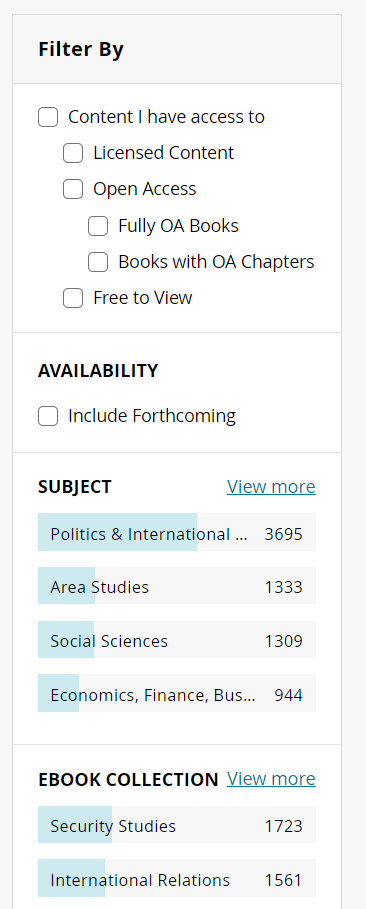
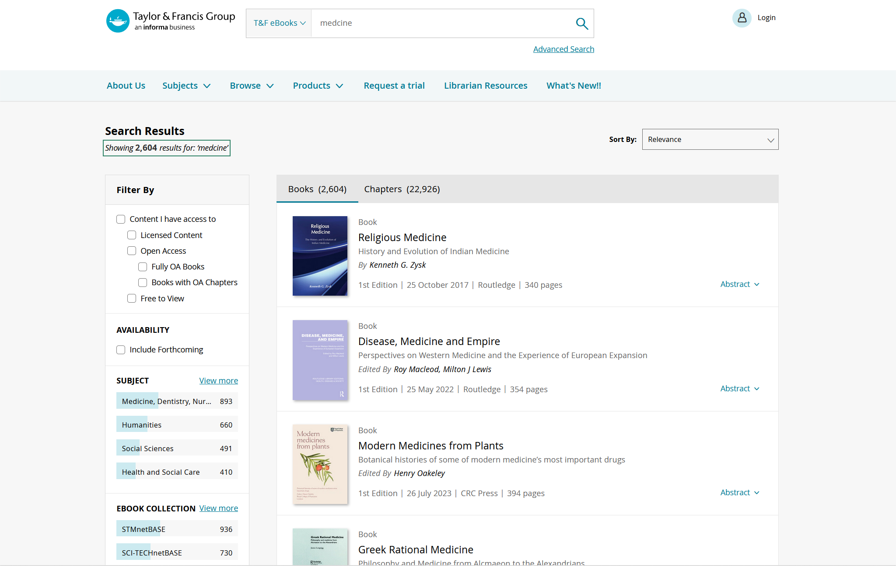
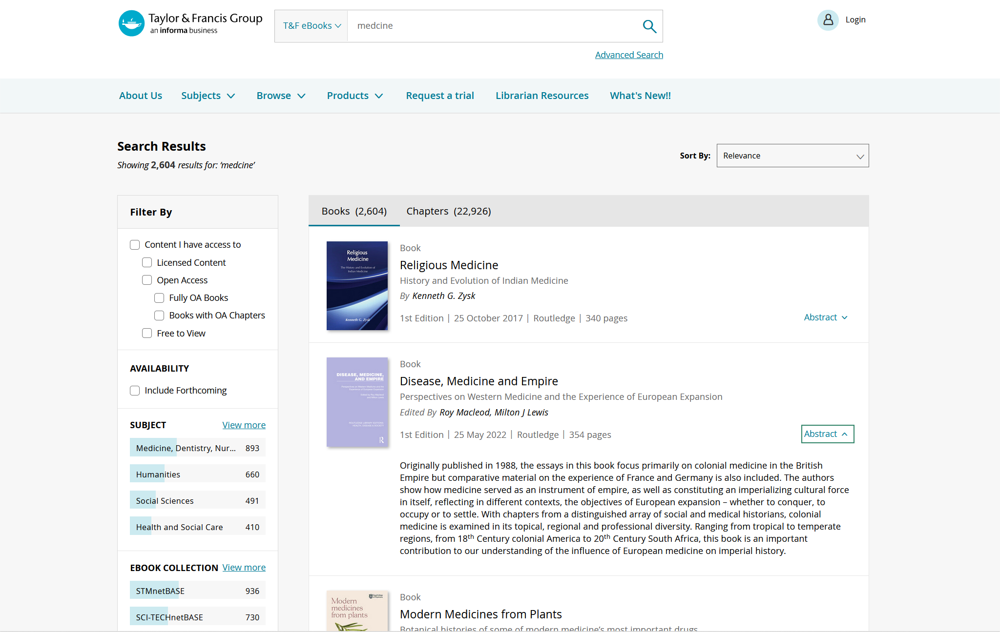
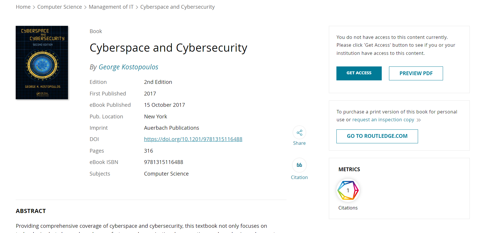
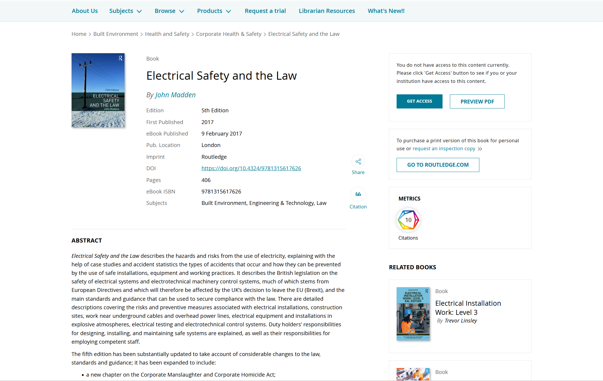
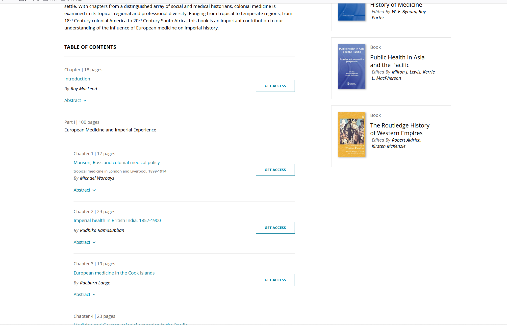
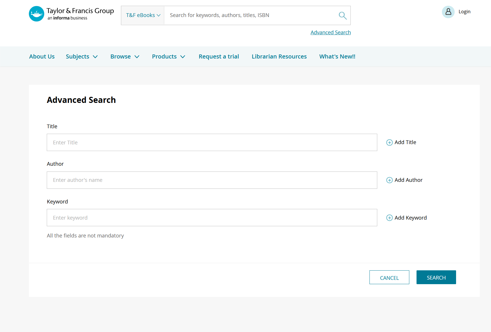
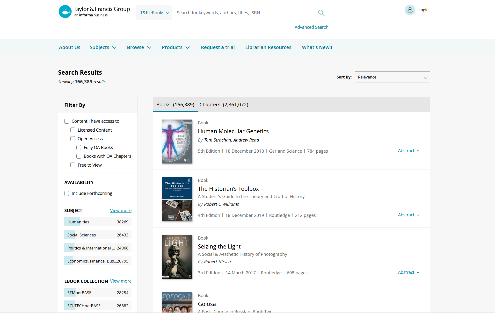
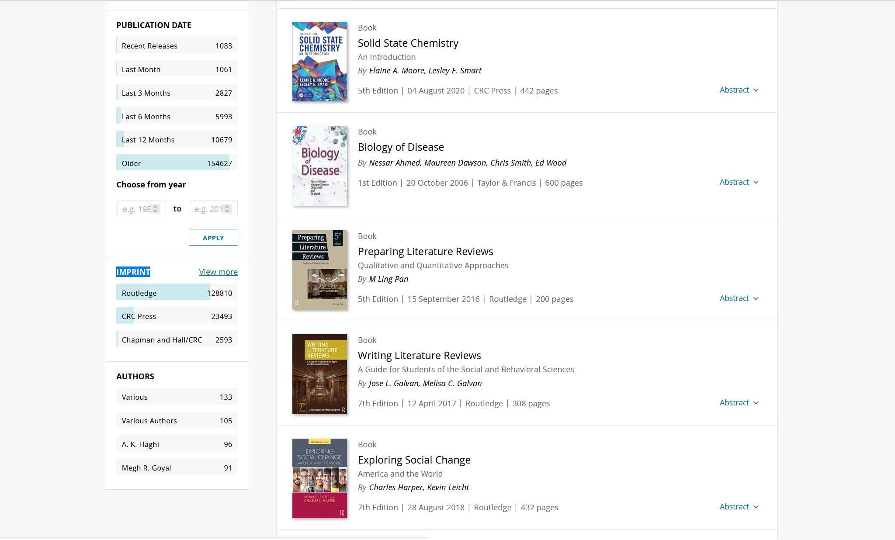

# Search Methods

# Quick Search

Enter the search term in the quick search box on the home page.

 <!--  -->

## Result Filtering

After entering keywords for a search, this is the search results filtering feature it generates, and we can filter the search results based on access type,subject, and other aspects.

1. **Permission Filtering** - Supports filtering results based on access permissions.

2. **Topic filtering** - Supports filtering results by topics related to search keywords.

3. **Time filtering** - Supports filtering results by specific time.

4. **Publishing Brand** - Supports categorizing by brand and filtering results according to it.

 <!--  -->

 <!--  -->

## Book Introduction

  Click on the book you want to query, and you will be directed to this page. Here, we can find more detailed information about the book, such as the edition, subjects, and more. We can also access the content of the book on this page.

 <!--  -->

On the book introduction page, you can view the detailed data of the book.

1. **Permission Type** - The type of access the reader has to the book.
2. **Title** - The title and subtitle of the book.
3. **Citations** - You can view the cited details of the book.
4. **Metadata** - All the data about the book.

 <!--  -->

By **Table of Contents**  can view the book index and download the book through this Section or part of.

 <!--  -->

# Advanced Search

Click the **Advanced search button** on the database home page to enter the advanced search page,advanced search allows you to **qualify multiple search fields** at the same time, including title, author and keywords.

 <!--  -->

# Navigation Browse

The navigation home page is shown below。

 <!--  -->

Navigation can be filtered based on **availability**, and can also be browsed by **publication topic**, each topic is subdivided into a number of lower class topics, which can be selected according to the topic you want to browse. Finally, the **author**, **publication date** and **publisher** can be selected.

 <!--  -->